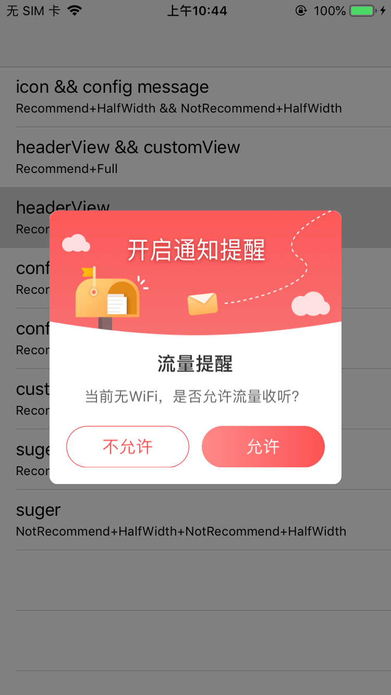

## QTAlertView

QTAlertView是蜻蜓FM iOS客户端对蜻蜓FM风格弹窗的封装，包括Alert和Sheet两种。


## 安装

```
// tag替换为最新的
pod 'QTAlertView', :git => "git@git2.qingtingfm.com:CocoaPods/qtalertview.git", :tag => '0.1.0'
```

## 使用

### QTAlertView基础使用

1.创建`QTAlertAction`的实例

```
QTAlertAction *action = [QTAlertAction actionFullWithTitle:@"确 定" style:QTAlertActionStyleRecommend];
```

2.创建`QTAlertView`的实例

```
QTAlertView *alert = [QTAlertView alertWithIconImage:nil
                     headerImage:[UIImage imageNamed:@"notificationAlertBackgorund"]
                                               title:@"流量提醒"
                                             message:@"当前无WiFi，是否允许流量收听？"
                                          customView:nil];
```

3.`alert`添加`action`

```
[alert addAction:action];
```

4.`alert`展示

```
[alert display];
```
效果如下:  


### QTAlertView部分快捷方法
```
/**
底部单按钮 右上角关闭按钮 AlertView

@param title 标题
@param message 内容
@param isShowClose  是否显示关闭按钮
@param closeClick   关闭按钮点击事件
@param confirmTitle 确认按钮标题
@param confirmStyle 确认按钮风格
@param confirmClick 确认按钮点击事件
*/
+ (void)showAlertWithTitle:(NSString * _Nullable)title message:(NSString * _Nullable)message showClose:(BOOL)isShowClose closeClick:(nullable void(^)(void))closeClick confirmTitle:(NSString * _Nullable)confirmTitle confirmStyle:(QTAlertActionStyle)confirmStyle confirmClick:(nullable void(^)(void))confirmClick;

/**
底部单按钮 AlertView

@param title 标题
@param message 内容
@param confirmTitle 确认按钮标题
@param confirmStyle 确认按钮风格
@param confirmClick 确认按钮点击事件
*/
+ (void)showAlertWithTitle:(NSString * _Nullable)title message:(NSString * _Nullable)message confirmTitle:(NSString * _Nullable)confirmTitle confirmStyle:(QTAlertActionStyle)confirmStyle confirmClick:(nullable void(^)(void))confirmClick;

/**
底部双按钮 AlertView

@param title 标题
@param message 内容
@param cancelTitle  取消按钮标题
@param cancelClick  取消按钮点击事件
@param confirmTitle 确认按钮标题
@param confirmClick 确认按钮点击事件
*/
+ (void)showAlertWithTitle:(NSString * _Nullable)title message:(NSString * _Nullable)message cancelTitle:(NSString * _Nullable)cancelTitle cancelClick:(nullable void(^)(void))cancelClick confirmTitle:(NSString * _Nullable)confirmTitle confirmClick:(nullable void(^)(void))confirmClick;
```


### QTSheetView基础使用

1.创建`QTSheetAction`的实例

```
QTSheetAction *sheet = [QTSheetAction actionWithTitle:@"删除" style:QTSheetActionStyleRed onClick:^{
    NSLog(@"删除");
}];
```

2.创建`QTAlertView`的实例

```
QTSheetView *sheet = [QTSheetView sheetView];

```

3.`alert`添加`action`

```
[alert addAction:action];
```

4.`alert`展示

```
[alert display];
```

## 内容介绍

### `QTAlertAction`负责AlertView中UIButton的样式


enum`QTAlertActionStyle`表示UIButton的样式:
```
typedef NS_ENUM(NSInteger, QTAlertActionStyle) {
    QTAlertActionStyleRecommend,             // 颜色渐变, 白字
    QTAlertActionStyleNotRecommend,          // 白色背景, 红色边框, 红字
    QTAlertActionStyleCustom,                // 自定义 Default font: 16.0 height: 20.0 backgroundColor: white
};
```
enum`QTAlertActionLayout`表示UIButton的布局:
```
typedef NS_ENUM(NSInteger, QTAlertActionLayout) {
    QTAlertActionLayoutFull,                 // 占据全部可用空间
    QTAlertActionLayoutHalfWidth,            // 宽度 0.5 高度 1.0
    QTAlertActionLayoutCustomHeight,         // 宽度 1.0 高度 Custom
};
```

下面方法创建`QTAlertAction`的实例:
```
/**
 QTAlertActionLayoutFull && click自己需求的点击事件
 */
+ (instancetype)actionFullWithTitle:(NSString *)title style:(QTAlertActionStyle)style;
+ (instancetype)actionFullWithTitle:(NSString *)title style:(QTAlertActionStyle)style onClick:(void(^)(void))onClick;

/**
 QTAlertActionLayoutHalfWidth && click自己需求的点击事件
 */
+ (instancetype)actionHalfWidthWithTitle:(NSString *)title style:(QTAlertActionStyle)style;
+ (instancetype)actionHalfWidthWithTitle:(NSString *)title style:(QTAlertActionStyle)style onClick:(void(^)(void))onClick;

/**
 自定义按钮样式: QTAlertActionStyleCustom && QTAlertActionLayoutCustomHeight
 
 @note: Default font: 16.0 height: 20.0 backgroundColor: white
 @note: config中直接设置button的frame font等
 */
+ (instancetype)actionCustomWithTitle:(NSString *)title config:(void(^)(UIButton *))config;
```

### `QTAlertView`负责AlertView中View
```
/**
 创建一个弹窗实例
 
 @param iconImage icon 图片
 @param headerImage header 图片
 @param title 标题
 @param message 文字描述
 @param customView 自定义View 自带距离顶部: 16.0 底部按钮: 20.0
 @return 弹窗实例
 */
+ (instancetype)alertWithIconImage:(UIImage *)iconImage
                       headerImage:(UIImage *)headerImage
                             title:(NSString *)title
                           message:(NSString *)message
                        customView:(UIView *)customView;

/**
 添加动作，按钮会按照添加的顺序由高到低排列
 */
- (void)addAction:(QTAlertAction *)action;

/**
 添加右上角的圆形关闭按钮，并添加动作
 */
- (void)addCloseButtonWithAction:(void(^)(void))action;

/**
 对标题和message进行额外的配置，比如修改字体，对齐方式
 
 @note: 修改frame无效
 */
- (void)addExtraConfig:(void(^)(UILabel * titleLabel, UILabel * messageLabel))config;

/**
 完全自定义 View
 */
+ (instancetype)alertWithCompleteCustomView:(UIView *)view;

/**
 展示
 */
- (void)display;
- (void)display:(void(^)(void))completion;

/**
 隐藏
 */
- (void)hide;
- (void)hide:(void(^)(void))completion;
```

### `QTAlertDisplayManager`负责AlertView的显示数量
```
@property (nonatomic, strong) NSMutableArray<QTAlertView *> *alertViewArray;
@property (nonatomic, assign) BOOL inDisplay;
```
inDisplay 表示是否正在显示，当inDisplay为YES时，alertViewArray会把其他需要显示AlertView储存起来。当当前显示的AlertView消失时，会把inDisplay置为NO，并检测alertViewArray中是否有存储AlertView，如果有则将其显示出来。
